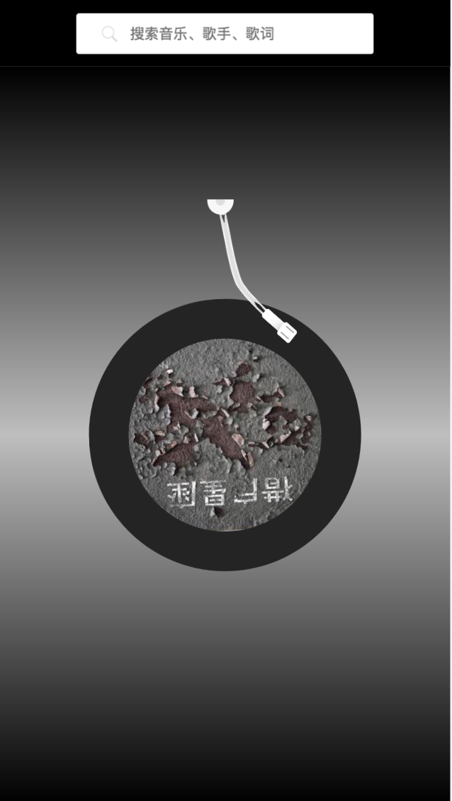

# vue2-music
> vue2.0 + vue-router + vuex + vue-resource 网易云音乐风格UI播放界面demo

## install and build

``` 
# install
npm install

# serve at localhost:8080
npm run dev

# build
npm run build
```
### 功能
* 歌曲搜索
* 歌曲播放、暂停（带动画）


#### 播放界面
